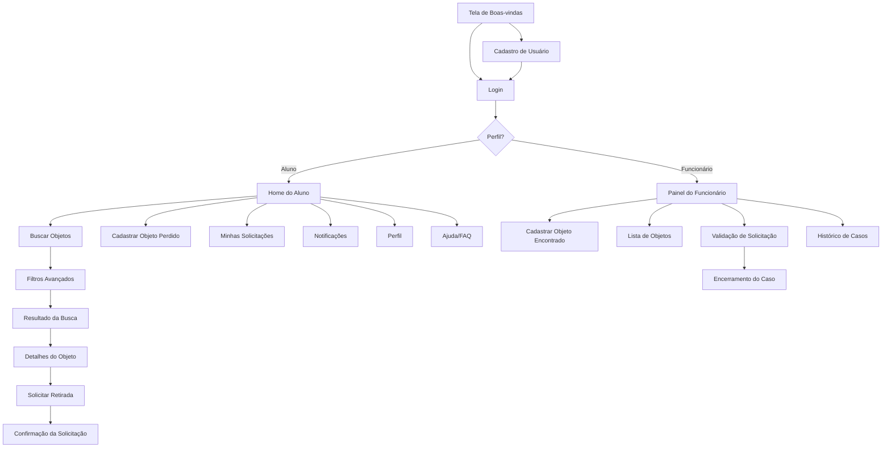

# Mapa do Site — Definição e Estrutura

## O que é um Mapa do Site?

O mapa do site (sitemap) é uma representação visual da arquitetura de informação de um sistema. Ele mostra a hierarquia das páginas/telas e os caminhos de navegação disponíveis para o usuário. É uma ferramenta essencial na fase de planejamento para garantir que a estrutura do sistema seja lógica, completa e navegável.

---

## Para que serve?

- Visualizar a estrutura completa do sistema antes de prototipar.
- Identificar telas que faltam ou que estão redundantes.
- Verificar se o fluxo de navegação é lógico.
- Comunicar a arquitetura para a equipe de desenvolvimento.
- Garantir que todos os perfis de acesso tenham seus fluxos contemplados.

---

## Diferença entre Mapa do Site e Fluxo de Navegação

| Mapa do Site | Fluxo de Navegação |
|---|---|
| Mostra a hierarquia (estrutura) | Mostra o caminho (sequência) |
| Estático | Dinâmico |
| "Quais telas existem?" | "Como o usuário chega lá?" |
| Parecido com organograma | Parecido com fluxograma |

No template, combinamos ambos em um diagrama Mermaid.

---

## Estrutura do Sistema de Achados e Perdidos

### Telas Públicas (sem login)
- Tela de boas-vindas
- Login
- Cadastro de usuário

### Telas do Aluno (logado)
- Home (objetos recentes + busca rápida)
- Buscar objetos
- Filtros avançados
- Resultado da busca
- Detalhes do objeto
- Solicitar retirada
- Confirmação da solicitação
- Cadastrar objeto perdido
- Minhas solicitações
- Notificações
- Perfil do usuário
- Ajuda/FAQ

### Telas do Funcionário (logado)
- Painel administrativo
- Cadastrar objeto encontrado
- Lista de objetos cadastrados
- Validação de solicitação
- Encerramento do caso
- Histórico de casos

---

## Diagrama Mermaid — Fluxo Completo

---

## Princípios de Organização

1. **Hierarquia clara** — Telas mais acessadas estão a poucos cliques da Home.
2. **Separação por perfil** — Aluno e funcionário têm fluxos distintos.
3. **Profundidade mínima** — Nenhuma ação principal requer mais de 4 cliques.
4. **Navegação persistente** — Menu/barra inferior sempre visível.
5. **Saídas claras** — Sempre possível voltar à Home ou à tela anterior.
