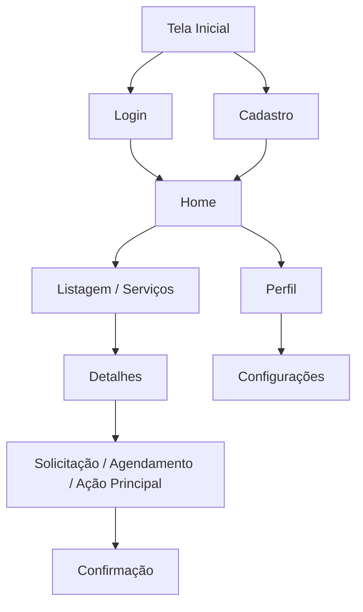

# UNIVERSIDADE ESTADUAL DO TOCANTINS – UNITINS

**Curso:** Sistemas de Informação  
**Disciplina:** Interface Humano-Computador (IHC)  
**Período Letivo:** 2026/1 – 6º Período – Câmpus Palmas  

# Título do Projeto

**Aluno:**  
**Matrícula:**  

**Aluno:**  
**Matrícula:**  

**Link para o protótipo interativo no Figma:**  

> Este documento é parte integrante da avaliação da disciplina de Interface Humano-Computador. O conteúdo será analisado com base nos conceitos estudados em aula e deverá demonstrar autoria, aplicação prática, domínio dos conceitos de IHC e uso das boas práticas em design de interface.

**Professor Responsável:** Prof. Me. Jeferson Morais da Costa

---

# Sumário

1. [Introdução e Objetivo do Projeto](#1-introdução-e-objetivo-do-projeto)
2. [Problema e Justificativa](#2-problema-e-justificativa)
3. [Pesquisa de Referência e Benchmarking](#3-pesquisa-de-referência-e-benchmarking)
4. [Definição de Personas](#4-definição-de-personas)
5. [Jornada do Usuário / Cenário de Uso](#5-jornada-do-usuário--cenário-de-uso)
6. [Mapa do Site](#6-mapa-do-site)
7. [Protótipo de Baixa Fidelidade](#7-protótipo-de-baixa-fidelidade)
8. [Protótipo de Alta Fidelidade](#8-protótipo-de-alta-fidelidade)
   - [8.1 Paleta de Cores](#81-paleta-de-cores)
   - [8.2 Tipografia e Ícones / Affordances](#82-tipografia-e-ícones--affordances)
   - [8.3 Aplicação das Heurísticas de Nielsen](#83-aplicação-das-heurísticas-de-nielsen)
   - [8.4 Telas Finais](#84-telas-finais)
9. [Considerações Finais](#9-considerações-finais)
10. [Referências](#10-referências)

---

# 1. Introdução e Objetivo do Projeto

Nesta seção, apresente o tema geral e a motivação para a escolha do projeto. O objetivo é situar o leitor sobre o que será desenvolvido e por que essa ideia é relevante.

## Tema do projeto

Descreva brevemente o assunto abordado pelo sistema ou aplicativo.

**Exemplo:** sistema para facilitar denúncias ambientais, aplicativo de doação de roupas, plataforma de agendamento de consultas etc.

**Texto:**  

## Cenário de aplicação

Explique onde ou em qual contexto o projeto seria útil. Pode mencionar ambiente urbano, escolar, doméstico, acadêmico, empresarial, público etc.

**Texto:**  

## Motivação da dupla

Explique por que o grupo escolheu esse tema. Pode ser uma vivência pessoal, uma necessidade percebida, uma pesquisa ou uma sugestão externa.

**Texto:**  

## Objetivo geral do projeto

Escreva um texto claro respondendo: **o que vocês querem alcançar com o desenvolvimento dessa interface?**

**Texto:**  

---

# 2. Problema e Justificativa

Esta seção tem como objetivo mostrar qual problema real motiva o desenvolvimento do projeto e por que ele merece ser resolvido.

## Descrição clara do problema

Descreva, em poucas linhas, qual situação está causando dificuldade ou prejuízo aos usuários.

**Texto:**  

## Contexto ou cenário do problema

Indique onde, quando ou com quem esse problema ocorre. Pode ser em determinada comunidade, faixa etária, setor de mercado, ambiente acadêmico etc.

**Texto:**  

## Evidências do problema

Apresente dados reais, notícias, estatísticas, entrevistas, observações ou experiências concretas que mostrem que o problema existe.

**Evidências:**

- 
- 
- 

## Justificativa para desenvolver a solução proposta

Explique por que vale a pena investir tempo e tecnologia para resolver ou minimizar esse problema.

**Texto:**  

## Conexão com as funcionalidades esperadas

Faça uma ponte entre o problema identificado e o tipo de interface que será proposta.

**Exemplo:** diante da dificuldade de agendar consultas presenciais, propomos um sistema que simplifica o processo em poucos toques.

**Texto:**  

---

# 3. Pesquisa de Referência e Benchmarking

Esta seção mostra que o grupo pesquisou soluções já existentes semelhantes ao projeto proposto, analisando pontos fortes, pontos fracos e aprendizados para o protótipo.

> Apresente pelo menos **3 sistemas ou aplicativos reais**.

## Sistema/App 1

**Nome:**  
**Link:**  
**Print de tela:** inserir imagem com legenda.  

**Descrição breve:**  

**Pontos fortes:**

- 
- 

**Pontos fracos:**

- 
- 

**Aprendizado para o projeto:**  

## Sistema/App 2

**Nome:**  
**Link:**  
**Print de tela:** inserir imagem com legenda.  

**Descrição breve:**  

**Pontos fortes:**

- 
- 

**Pontos fracos:**

- 
- 

**Aprendizado para o projeto:**  

## Sistema/App 3

**Nome:**  
**Link:**  
**Print de tela:** inserir imagem com legenda.  

**Descrição breve:**  

**Pontos fortes:**

- 
- 

**Pontos fracos:**

- 
- 

**Aprendizado para o projeto:**  

---

# 4. Definição de Personas

Nesta seção, construa três personas com base no público que usará o sistema.

## Requisitos obrigatórios

- Deve haver pelo menos **dois perfis de acesso distintos**;
- Uma das personas deve representar uma **Pessoa com Deficiência (PCD)** — física, auditiva, visual ou cognitiva;
- As personas devem estar conectadas com o problema definido na Seção 2.

## Persona 1

| Campo | Informação |
|---|---|
| Nome |  |
| Idade |  |
| Ocupação |  |
| Nível educacional |  |
| Acesso à internet |  |
| Acesso a smartphone |  |
| Possui deficiência? |  |
| Descrição da deficiência, se houver |  |
| 3 cores favoritas |  |
| Perfil de acesso |  |
| Motivação para uso do sistema |  |

## Persona 2

| Campo | Informação |
|---|---|
| Nome |  |
| Idade |  |
| Ocupação |  |
| Nível educacional |  |
| Acesso à internet |  |
| Acesso a smartphone |  |
| Possui deficiência? |  |
| Descrição da deficiência, se houver |  |
| 3 cores favoritas |  |
| Perfil de acesso |  |
| Motivação para uso do sistema |  |

## Persona 3

| Campo | Informação |
|---|---|
| Nome |  |
| Idade |  |
| Ocupação |  |
| Nível educacional |  |
| Acesso à internet |  |
| Acesso a smartphone |  |
| Possui deficiência? |  |
| Descrição da deficiência, se houver |  |
| 3 cores favoritas |  |
| Perfil de acesso |  |
| Motivação para uso do sistema |  |

---

# 5. Jornada do Usuário / Cenário de Uso

Nesta seção, descreva um cenário de uso do sistema a partir da perspectiva de duas personas criadas anteriormente.

## Persona escolhida 1: [Nome da Persona]

| Etapa | O que a persona faz | O que ela espera | Dificuldade | Emoção | Como o sistema ajuda |
|---|---|---|---|---|---|
| 1 |  |  |  |  |  |
| 2 |  |  |  |  |  |
| 3 |  |  |  |  |  |
| 4 |  |  |  |  |  |
| 5 |  |  |  |  |  |

## Persona escolhida 2: [Nome da Persona]

| Etapa | O que a persona faz | O que ela espera | Dificuldade | Emoção | Como o sistema ajuda |
|---|---|---|---|---|---|
| 1 |  |  |  |  |  |
| 2 |  |  |  |  |  |
| 3 |  |  |  |  |  |
| 4 |  |  |  |  |  |
| 5 |  |  |  |  |  |

---

# 6. Mapa do Site

Nesta seção, apresente o fluxo de navegação entre as telas do sistema.

## O que é um Mapa do Site?

É um desenho ou diagrama que mostra a estrutura geral do sistema e como as páginas se conectam. Ele ajuda a visualizar a hierarquia das telas e os caminhos que o usuário pode seguir.

## O que deve conter

- As principais telas do sistema;
- As conexões entre elas, usando setas ou linhas;
- Uma organização lógica e limpa;
- Nomes simples nas telas, como: `Home`, `Login`, `Cadastro`, `Perfil`, `Serviços`, `Detalhes`, `Confirmação`.

## Diagrama do fluxo de navegação

**Observação:** ajuste os nomes das telas conforme o tema escolhido pelo grupo.

---

# 7. Protótipo de Baixa Fidelidade

Nesta seção, apresente pelo menos **5 wireframes** do sistema. Os wireframes representam a estrutura das telas, sem cores, ícones sofisticados ou detalhes visuais completos.

## Tela 1 — [Nome da tela]

**Função da tela:**  

**Elementos presentes:**

- 
- 
- 

**Próximo passo do usuário:**  

**Imagem do wireframe:**  

## Tela 2 — [Nome da tela]

**Função da tela:**  

**Elementos presentes:**

- 
- 
- 

**Próximo passo do usuário:**  

**Imagem do wireframe:**  

## Tela 3 — [Nome da tela]

**Função da tela:**  

**Elementos presentes:**

- 
- 
- 

**Próximo passo do usuário:**  

**Imagem do wireframe:**  

## Tela 4 — [Nome da tela]

**Função da tela:**  

**Elementos presentes:**

- 
- 
- 

**Próximo passo do usuário:**  

**Imagem do wireframe:**  

## Tela 5 — [Nome da tela]

**Função da tela:**  

**Elementos presentes:**

- 
- 
- 

**Próximo passo do usuário:**  

**Imagem do wireframe:**  

---

# 8. Protótipo de Alta Fidelidade

Nesta seção, apresente o protótipo final do sistema, já com design visual completo, cores, tipografia, ícones e interações.

O protótipo deve demonstrar conceitos de IHC, como:

- Affordances;
- Heurísticas de Nielsen;
- Navegação clara;
- Coerência com o problema identificado;
- Boa experiência do usuário.

---

## 8.1 Paleta de Cores

Descreva a paleta de cores utilizada no sistema/aplicativo.

## Cores favoritas das personas

| Persona | Cor 1 | Cor 2 | Cor 3 |
|---|---|---|---|
| Persona 1 |  |  |  |
| Persona 2 |  |  |  |
| Persona 3 |  |  |  |

## Paleta escolhida

| Cor | Código HEX | Uso na interface |
|---|---|---|
| Primária |  |  |
| Secundária |  |  |
| Fundo |  |  |
| Texto |  |  |
| Alerta/erro |  |  |
| Sucesso/confirmação |  |  |

**Lógica cromática usada:**  
Exemplo: cores complementares, análogas, tríade, monocromática etc.

**Ferramenta utilizada:**  
Exemplo: Coolors, Adobe Color, Paletton etc.

**Justificativa das escolhas:**  
Explique a relação com o público-alvo, acessibilidade, harmonia visual ou identidade do sistema.

---

## 8.2 Tipografia e Ícones / Affordances

Nesta parte, mostre como o conceito de affordance foi aplicado nos elementos da interface, facilitando a interação do usuário.

## Tipografia

**Fonte principal:**  
**Fonte secundária, se houver:**  
**Justificativa:**  

## Ícones

**Biblioteca de ícones utilizada:**  
Exemplo: Material Icons, Font Awesome, Lucide, Bootstrap Icons etc.

**Justificativa:**  

## Affordances usadas

Identifique pelo menos **3 tipos diferentes de affordance** usados no protótipo.

| Tela | Tipo de affordance | Onde aparece | Função | Como ajuda o usuário |
|---|---|---|---|---|
| 1 |  |  |  |  |
| 2 |  |  |  |  |
| 3 |  |  |  |  |
| 4 |  |  |  |  |
| 5 |  |  |  |  |

---

## 8.3 Aplicação das Heurísticas de Nielsen

Escolha **4 heurísticas de Nielsen** aplicadas ao protótipo e relacione cada uma a telas específicas do sistema.

| Heurística | Tela(s) onde aparece | Como foi aplicada | Impacto positivo na experiência do usuário |
|---|---|---|---|
| 1. Visibilidade do estado do sistema |  |  |  |
| 2. Correspondência entre sistema e mundo real |  |  |  |
| 3. Consistência e padrões |  |  |  |
| 4. Prevenção de erros |  |  |  |

**Prints com marcações:**  
Inserir imagens das telas com anotações, se possível.

---

## 8.4 Telas Finais

Nesta parte, apresente no mínimo **15 telas do protótipo final**. A tela de login **não conta** nesse total.

Cada tela deve ter:

- Título;
- Print exportado do Figma;
- Breve explicação;
- Objetivo principal da tela.

## Tela Final 1 — [Nome da tela]

**Objetivo principal:**  
**Explicação:**  
**Print:**  

## Tela Final 2 — [Nome da tela]

**Objetivo principal:**  
**Explicação:**  
**Print:**  

## Tela Final 3 — [Nome da tela]

**Objetivo principal:**  
**Explicação:**  
**Print:**  

## Tela Final 4 — [Nome da tela]

**Objetivo principal:**  
**Explicação:**  
**Print:**  

## Tela Final 5 — [Nome da tela]

**Objetivo principal:**  
**Explicação:**  
**Print:**  

## Tela Final 6 — [Nome da tela]

**Objetivo principal:**  
**Explicação:**  
**Print:**  

## Tela Final 7 — [Nome da tela]

**Objetivo principal:**  
**Explicação:**  
**Print:**  

## Tela Final 8 — [Nome da tela]

**Objetivo principal:**  
**Explicação:**  
**Print:**  

## Tela Final 9 — [Nome da tela]

**Objetivo principal:**  
**Explicação:**  
**Print:**  

## Tela Final 10 — [Nome da tela]

**Objetivo principal:**  
**Explicação:**  
**Print:**  

## Tela Final 11 — [Nome da tela]

**Objetivo principal:**  
**Explicação:**  
**Print:**  

## Tela Final 12 — [Nome da tela]

**Objetivo principal:**  
**Explicação:**  
**Print:**  

## Tela Final 13 — [Nome da tela]

**Objetivo principal:**  
**Explicação:**  
**Print:**  

## Tela Final 14 — [Nome da tela]

**Objetivo principal:**  
**Explicação:**  
**Print:**  

## Tela Final 15 — [Nome da tela]

**Objetivo principal:**  
**Explicação:**  
**Print:**  

---

# 9. Considerações Finais

Nesta parte final, reflita sobre a experiência de desenvolver o projeto.

## O que vocês aprenderam

Comente sobre os principais aprendizados durante o processo de criação do protótipo.

**Texto:**  

## Quais foram os maiores desafios

Relate os pontos mais difíceis do projeto.

**Texto:**  

## O que vocês fariam diferente

Explique o que melhorariam se tivessem mais tempo ou mais domínio técnico.

**Texto:**  

## Como essa experiência contribui para sua formação profissional

Explique como entender o usuário e projetar boas interfaces contribui para o desenvolvimento de sistemas.

**Texto:**  

---

# 10. Referências

Liste todas as fontes teóricas, visuais ou técnicas utilizadas no desenvolvimento do projeto.

## Fontes teóricas

- 
- 
- 

## Fontes práticas

- 
- 
- 

## Ferramentas utilizadas

- Figma — 
- Coolors / Adobe Color / Paletton — 
- Biblioteca de ícones — 

## Tutoriais e vídeos

- 
- 
- 
