# UNIVERSIDADE ESTADUAL DO TOCANTINS – UNITINS

**Curso:** Sistemas de Informação  
**Disciplina:** Interface Humano-Computador (IHC)  
**Período Letivo:** 2026/1 – 6º Período – Câmpus Palmas  

# Sistema de Achados e Perdidos Universitário — UniAchados

**Aluno:**  
**Matrícula:**  

**Aluno:**  
**Matrícula:**  

**Link para o protótipo interativo no Figma:**  

> Este documento é parte integrante da avaliação da disciplina de Interface Humano-Computador. O conteúdo será analisado com base nos conceitos estudados em aula e deverá demonstrar autoria, aplicação prática, domínio dos conceitos de IHC e uso das boas práticas em design de interface.

**Professor Responsável:** Prof. Me. Jeferson Morais da Costa

---

# Sumário

1. [Introdução e Objetivo do Projeto](#1-introdução-e-objetivo-do-projeto)
2. [Problema e Justificativa](#2-problema-e-justificativa)
3. [Pesquisa de Referência e Benchmarking](#3-pesquisa-de-referência-e-benchmarking)
4. [Definição de Personas](#4-definição-de-personas)
5. [Jornada do Usuário / Cenário de Uso](#5-jornada-do-usuário--cenário-de-uso)
6. [Mapa do Site](#6-mapa-do-site)
7. [Protótipo de Baixa Fidelidade](#7-protótipo-de-baixa-fidelidade)
8. [Protótipo de Alta Fidelidade](#8-protótipo-de-alta-fidelidade)
    - [8.1 Paleta de Cores](#81-paleta-de-cores)
    - [8.2 Tipografia e Ícones / Affordances](#82-tipografia-e-ícones--affordances)
    - [8.3 Aplicação das Heurísticas de Nielsen](#83-aplicação-das-heurísticas-de-nielsen)
    - [8.4 Telas Finais](#84-telas-finais)
9. [Considerações Finais](#9-considerações-finais)
10. [Referências](#10-referências)

---

# 1. Introdução e Objetivo do Projeto

## Tema do projeto

O projeto aborda o desenvolvimento de uma plataforma digital de achados e perdidos voltada para o ambiente universitário. O sistema, denominado "UniAchados", permite que alunos, professores e funcionários cadastrem objetos perdidos ou encontrados dentro do campus, realizem buscas detalhadas e gerenciem o processo de devolução de forma organizada e segura.

## Cenário de aplicação

O sistema se aplica ao contexto acadêmico universitário, especificamente dentro dos câmpus da Universidade Estadual do Tocantins (UNITINS). O ambiente universitário é caracterizado por grande circulação de pessoas em espaços compartilhados — salas de aula, bibliotecas, laboratórios, cantinas e áreas de convivência — onde a perda de objetos pessoais é frequente e a recuperação é dificultada pela ausência de um canal centralizado de comunicação.

## Motivação da dupla

A motivação para a escolha deste tema surgiu da experiência pessoal no ambiente acadêmico. É comum observar objetos abandonados em salas de aula e corredores sem que haja um meio eficiente de conectar quem perdeu com quem encontrou. Atualmente, a comunicação ocorre por grupos informais de WhatsApp ou avisos em murais físicos, que são limitados em alcance e organização. Identificamos a oportunidade de resolver esse problema com uma solução digital acessível e centrada no usuário.

## Objetivo geral do projeto

Projetar uma interface digital intuitiva, acessível e funcional que facilite o cadastro, a busca e a devolução de objetos perdidos e encontrados no ambiente universitário, promovendo organização institucional e reduzindo o tempo entre a perda e a recuperação de itens.

---

# 2. Problema e Justificativa

## Descrição clara do problema

Não existe um canal centralizado, digital e acessível para que a comunidade universitária registre e busque objetos perdidos ou encontrados no campus. A comunicação sobre itens extraviados ocorre de forma fragmentada, informal e ineficiente, resultando em objetos que nunca retornam aos seus donos.

## Contexto ou cenário do problema

O problema ocorre diariamente em universidades de médio e grande porte, onde centenas ou milhares de pessoas circulam por múltiplos prédios e espaços. No caso da UNITINS – Câmpus Palmas, a comunidade acadêmica inclui alunos de diversos cursos, professores, técnicos administrativos e funcionários terceirizados. Objetos como carregadores, fones de ouvido, garrafas, documentos, óculos e mochilas são frequentemente esquecidos em locais de uso coletivo.

## Evidências do problema

- Observação direta: é comum encontrar objetos esquecidos em salas de aula, bibliotecas e laboratórios ao final dos turnos, sem identificação do dono.
- Relatos informais de colegas: diversos alunos relatam ter perdido itens no campus e não saber a quem recorrer ou onde procurar.
- Limitação dos meios atuais: grupos de WhatsApp de turma têm alcance restrito (apenas membros do grupo); murais físicos são ignorados pela maioria; secretarias acumulam objetos sem sistema de busca.
- Hipótese a ser validada: estima-se que a maioria dos objetos encontrados no campus nunca retorne ao dono original por falta de um meio de conexão eficiente.

## Justificativa para desenvolver a solução proposta

A perda de objetos pessoais gera prejuízo financeiro, emocional e prático para os membros da comunidade universitária. Uma solução digital centralizada pode reduzir significativamente o tempo de recuperação, aumentar a taxa de devoluções e organizar o processo institucional de gerenciamento de itens encontrados. Além disso, o desenvolvimento de uma interface acessível atende às necessidades de pessoas com deficiência, promovendo inclusão digital no ambiente acadêmico.

## Conexão com as funcionalidades esperadas

Diante da ausência de um canal unificado para registro e busca de objetos, propomos um sistema que permite: (1) cadastro rápido de objetos perdidos ou encontrados com foto e descrição; (2) busca com filtros por categoria, local, data e status; (3) solicitação de retirada com validação de identidade; e (4) acompanhamento de status em tempo real. Essas funcionalidades atacam diretamente o problema da fragmentação e informalidade do processo atual.

---

# 3. Pesquisa de Referência e Benchmarking

## Sistema/App 1

**Nome:** Achusp — Achados e Perdidos da USP  
**Link:** https://ccsl.ime.usp.br/pt-br/projeto/achusp/  
**Print de tela:** *Inserir captura de tela da página do Achusp/CCSL-USP com legenda.*  

**Descrição breve:** Projeto do Centro de Competência em Software Livre (CCSL/IME-USP) descrito como um site de achados e perdidos para a Universidade de São Paulo. A própria página informa que o sistema web permite cadastrar e buscar itens achados ou perdidos e que o projeto foi pensado para gerenciar departamentos de achados e perdidos.

**Pontos fortes:**

- Voltado especificamente para o contexto universitário.
- Permite cadastrar e buscar itens achados ou perdidos.
- Projeto de código aberto, permitindo estudo de funcionamento e adaptação.

**Pontos fracos:**

- Interface visual desatualizada e pouco responsiva.
- Pouca evidência pública de fluxo mobile-first ou interface atualizada.
- Documentação pública limitada sobre validação de retirada e notificação ao usuário.

**Aprendizado para o projeto:** O UniAchados deve manter o foco universitário e a separação clara entre cadastro e busca, mas evoluir com interface mobile-first, uso de fotos nos cards, filtros visuais e fluxo de retirada mais guiado.

## Sistema/App 2

**Nome:** GLPI — Sistema de Chamados do IFSP São João da Boa Vista  
**Link:** https://docs-cti.sbv.ifsp.edu.br/books/manual-de-servi%C3%A7os-digitais/page/%F0%9F%94%84-como-acompanhar-e-atualizar-um-chamado  
**Print de tela:** *Inserir captura de tela do manual público do GLPI/IFSP com legenda.*  

**Descrição breve:** Manual público do IFSP que demonstra o uso do GLPI para abertura, acompanhamento e atualização de chamados. Embora seja voltado a serviços digitais e suporte, a lógica de ticket, status, anexos, respostas e validação é relevante para o fluxo administrativo de um sistema de achados e perdidos.

**Pontos fortes:**

- Permite acompanhar o andamento de uma solicitação em "Meus chamados".
- Aceita complementos no chamado com novos detalhes, links, imagens e arquivos.
- Possui registro de validação por outra pessoa, útil para processos que exigem aprovação.

**Pontos fracos:**

- Interface genérica, não otimizada para achados e perdidos.
- Fluxo pensado para suporte/manutenção, não para identificação visual de objetos.
- Visual pouco amigável e sem recursos visuais como fotos.

**Aprendizado para o projeto:** O modelo de acompanhamento por solicitação é útil para o UniAchados, principalmente no fluxo de retirada e validação pelo funcionário. O projeto deve aproveitar a ideia de histórico e status, mas simplificar a interface, reduzir campos desnecessários e priorizar foto, categoria, local e data do objeto.

## Sistema/App 3

**Nome:** FoundIt (Aplicativo Mobile)  
**Link:** https://play.google.com/store/apps/details?id=za.co.founditapp&hl=en-US | https://founditproject.com/  
**Print de tela:** *Inserir captura de tela da página do Google Play ou da versão web do FoundIt com legenda.*  

**Descrição breve:** Aplicativo real de achados e perdidos disponível no Google Play, voltado ao registro de itens perdidos e encontrados em comunidades. A página pública descreve funções como postar itens perdidos com fotos, detalhes e local, registrar itens encontrados, navegar por categorias, pesquisar por tipo/local/palavra-chave e conectar pessoas para devolução. Também há uma versão/projeto universitário público do FoundIt voltado ao campus da University of Maryland.

**Pontos fortes:**

- Interface moderna, visual e mobile-first.
- Uso de fotos como elemento principal dos cards.
- Organização por categorias, localização e palavra-chave.
- Foco em reconectar quem perdeu com quem encontrou.

**Pontos fracos:**

- Depende de massa crítica de usuários ativos para ser útil.
- Sem validação de identidade, o que gera risco de fraude.
- Ausência de perfil administrativo institucional.

**Aprendizado para o projeto:** O padrão de cards com foto + título + local + data será adotado. A validação de identidade é indispensável em contexto institucional. O perfil administrativo (funcionário) agrega segurança e organização ao processo de devolução.

---

# 4. Definição de Personas

## Persona 1

| Campo | Informação |
|---|---|
| Nome | Ana Silva |
| Idade | 19 anos |
| Ocupação | Estudante de graduação em Sistemas de Informação |
| Nível educacional | Ensino superior incompleto (2º período) |
| Acesso à internet | Wi-Fi no campus e dados móveis 4G |
| Acesso a smartphone | Sim — smartphone Android intermediário |
| Possui deficiência? | Não |
| Descrição da deficiência, se houver | Não se aplica |
| 3 cores favoritas | Azul, roxo, branco |
| Perfil de acesso | Aluno/Usuário comum |
| Motivação para uso do sistema | Perdeu o carregador na biblioteca e deseja verificar rapidamente pelo celular se alguém o encontrou e cadastrou no sistema |

## Persona 2

| Campo | Informação |
|---|---|
| Nome | Carlos Mendes |
| Idade | 45 anos |
| Ocupação | Técnico administrativo — Secretaria Acadêmica |
| Nível educacional | Ensino médio completo |
| Acesso à internet | Rede cabeada no trabalho e Wi-Fi doméstico |
| Acesso a smartphone | Sim — smartphone Android básico |
| Possui deficiência? | Não |
| Descrição da deficiência, se houver | Não se aplica |
| 3 cores favoritas | Verde, cinza, azul |
| Perfil de acesso | Funcionário/Administrador |
| Motivação para uso do sistema | Recebe diariamente objetos encontrados por terceiros na secretaria e precisa cadastrá-los, organizar as devoluções e validar solicitações de retirada |

## Persona 3

| Campo | Informação |
|---|---|
| Nome | Beatriz Oliveira |
| Idade | 23 anos |
| Ocupação | Estudante de graduação em Pedagogia |
| Nível educacional | Ensino superior incompleto (5º período) |
| Acesso à internet | Wi-Fi no campus e dados móveis 4G |
| Acesso a smartphone | Sim — smartphone Android intermediário |
| Possui deficiência? | Sim |
| Descrição da deficiência, se houver | Deficiência auditiva bilateral severa. Comunica-se por Libras e português escrito. Não utiliza aparelho auditivo. Toda comunicação deve ser visual/textual. |
| 3 cores favoritas | Azul, amarelo, preto |
| Perfil de acesso | Aluno/Usuário comum |
| Motivação para uso do sistema | Encontrou uma mochila esquecida na sala de aula e deseja cadastrá-la no sistema para que o dono possa recuperá-la. Precisa de interface clara, visual e sem dependência de áudio. |

---

# 5. Jornada do Usuário / Cenário de Uso

## Persona escolhida 1: Ana Silva

**Cenário:** Ana perdeu seu carregador na biblioteca do campus durante a manhã. À tarde, decide verificar pelo celular se alguém o encontrou e cadastrou no sistema.

| Etapa | O que a persona faz | O que ela espera | Dificuldade | Emoção | Como o sistema ajuda |
|---|---|---|---|---|---|
| 1 | Abre o aplicativo no celular e faz login com sua conta institucional | Acesso rápido sem burocracia | Pode não lembrar a senha ou não conhecer o sistema | Ansiedade e preocupação | Login com credencial institucional (SSO) e opção "Esqueci a senha"; interface de boas-vindas explicativa |
| 2 | Digita "carregador" no campo de busca e aplica filtro de local "Biblioteca" | Encontrar seu carregador nos resultados | Pode haver vários carregadores cadastrados | Esperança misturada com dúvida | Filtros por local, data e categoria reduzem resultados; cards com foto facilitam identificação visual |
| 3 | Visualiza os resultados e clica no card de um carregador branco encontrado na biblioteca hoje | Confirmar se é o seu objeto pela foto e descrição | A foto pode não ser clara o suficiente | Expectativa crescente | Foto em alta resolução, descrição detalhada, local exato e data/hora do achado |
| 4 | Clica em "Solicitar Retirada" e preenche breve justificativa | Processo simples e rápido | Não saber quais informações precisa fornecer | Apreensão sobre o processo | Formulário curto com campos claros e instruções visíveis; indicação de documentos necessários |
| 5 | Recebe confirmação na tela e aguarda validação do funcionário | Saber que o pedido foi registrado e acompanhar o status | Incerteza sobre quando será respondida | Alívio parcial, ansiedade residual | Tela de confirmação com próximos passos; status atualizado em "Minhas Solicitações"; notificação quando validado |

## Persona escolhida 2: Beatriz Oliveira

**Cenário:** Beatriz encontrou uma mochila esquecida na sala de aula após a última aula do turno. Decide cadastrá-la no sistema para ajudar o dono a recuperá-la.

| Etapa | O que a persona faz | O que ela espera | Dificuldade | Emoção | Como o sistema ajuda |
|---|---|---|---|---|---|
| 1 | Abre o aplicativo no celular e acessa sua conta | Interface clara e sem barreiras de comunicação | Sistemas que usam áudio ou instruções confusas | Cautela e atenção | Interface 100% visual, sem dependência de som; textos curtos e objetivos; ícones claros |
| 2 | Toca no botão "Cadastrar Objeto Encontrado" na home | Encontrar a opção facilmente | Botão pode estar escondido ou com nome confuso | Confiança ao localizar a opção | Botão com ícone + texto explícito visível na home; posição de destaque |
| 3 | Preenche o formulário: nome do objeto, categoria, local, tira foto | Formulário simples com campos bem rotulados | Campos sem label ou com instruções ambíguas | Paciência e foco | Labels claros acima de cada campo; placeholders auxiliares; ícone de câmera para foto; barra de progresso do upload |
| 4 | Toca em "Enviar Cadastro" e aguarda confirmação | Feedback visual imediato de que deu certo | Não saber se o envio foi concluído (ausência de som) | Expectativa | Toast visual de sucesso (banner verde + ícone check + texto "Cadastro realizado!"); sem dependência de áudio |
| 5 | Acompanha o status do objeto na aba "Minhas Contribuições" | Ver se alguém reclamou o objeto | Notificações por som que ela não ouviria | Satisfação por ter ajudado | Badge numérico no ícone de notificações; status textual atualizado; vibração do celular como alerta opcional |

---

# 6. Mapa do Site

O sistema é organizado em dois perfis de acesso distintos — Aluno e Funcionário — cada um com seu próprio conjunto de telas e fluxos de interação. Para facilitar a leitura e a análise, a documentação foi dividida em três diagramas complementares: o Mapa do Site apresenta a arquitetura de telas de forma hierárquica, sem decisões de negócio; o Fluxo do Aluno detalha as etapas de busca, solicitação de retirada e cadastro de objeto perdido; e o Fluxo do Funcionário descreve o processo de cadastro de objetos encontrados, validação de solicitações e encerramento de casos.

## Diagrama 1 — Mapa do Site

Representa a estrutura hierárquica de telas do sistema, organizada por perfil de acesso. Não inclui lógica de negócio nem decisões de fluxo.

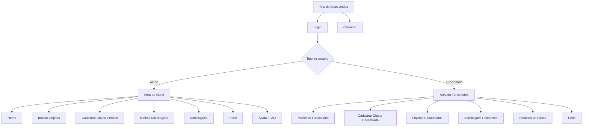
```mermaid
flowchart TD
  A[Tela de Boas-vindas] --> B[Login]
  A --> C[Cadastro]
  B --> D{Tipo de usuário}

  D -->|Aluno| E[Área do Aluno]
  D -->|Funcionário| F[Área do Funcionário]

  E --> E1[Home]
  E --> E2[Buscar Objetos]
  E --> E3[Cadastrar Objeto Perdido]
  E --> E4[Minhas Solicitações]
  E --> E5[Notificações]
  E --> E6[Perfil]
  E --> E7[Ajuda / FAQ]

  F --> F1[Painel do Funcionário]
  F --> F2[Cadastrar Objeto Encontrado]
  F --> F3[Objetos Cadastrados]
  F --> F4[Solicitações Pendentes]
  F --> F5[Histórico de Casos]
  F --> F6[Perfil]
```

---

## Diagrama 2 — Fluxo do Aluno

Representa as ações do aluno: busca de objetos, solicitação de retirada e cadastro de objeto perdido.

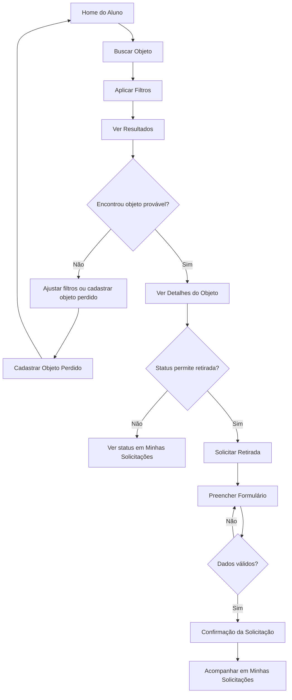
```mermaid
flowchart TD
  A[Home do Aluno] --> B[Buscar Objeto]
  B --> C[Aplicar Filtros]
  C --> D[Ver Resultados]
  D --> E{Encontrou objeto provável?}

  E -->|Não| F[Ajustar filtros ou cadastrar objeto perdido]
  F --> G[Cadastrar Objeto Perdido]
  G --> A

  E -->|Sim| H[Ver Detalhes do Objeto]
  H --> I{Status permite retirada?}

  I -->|Não| J[Ver status em Minhas Solicitações]

  I -->|Sim| K[Solicitar Retirada]
  K --> L[Preencher Formulário]
  L --> M{Dados válidos?}
  M -->|Não| L
  M -->|Sim| N[Confirmação da Solicitação]
  N --> O[Acompanhar em Minhas Solicitações]
```

---

## Diagrama 3 — Fluxo do Funcionário

Representa as ações do funcionário: cadastro de objeto encontrado, validação de solicitações e encerramento de casos.

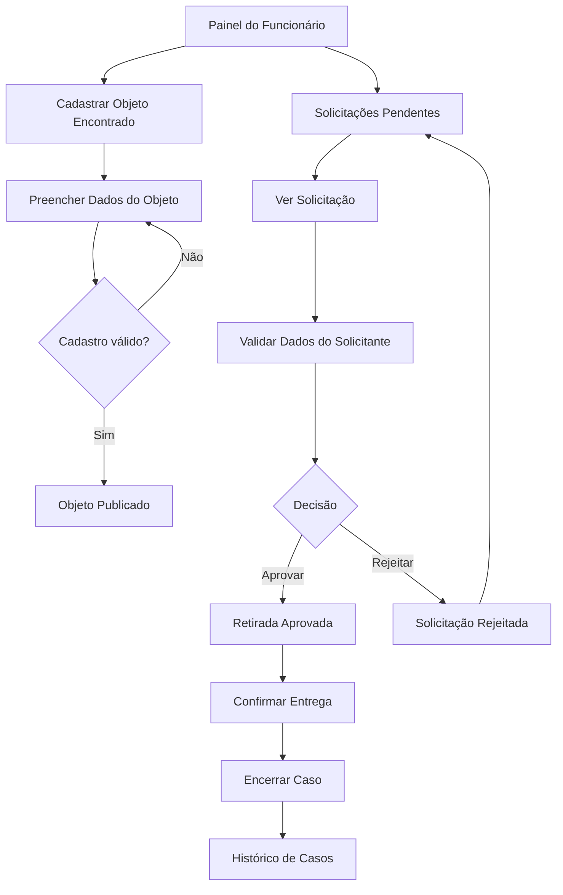
```mermaid
flowchart TD
  A[Painel do Funcionário] --> B[Cadastrar Objeto Encontrado]
  A --> C[Solicitações Pendentes]

  B --> D[Preencher Dados do Objeto]
  D --> E{Cadastro válido?}
  E -->|Não| D
  E -->|Sim| F[Objeto Publicado]

  C --> G[Ver Solicitação]
  G --> H[Validar Dados do Solicitante]
  H --> I{Decisão}
  I -->|Aprovar| J[Retirada Aprovada]
  I -->|Rejeitar| K[Solicitação Rejeitada]
  K --> C

  J --> L[Confirmar Entrega]
  L --> M[Encerrar Caso]
  M --> N[Histórico de Casos]
```
**Critérios de IHC considerados no fluxo:**

- **Visibilidade do estado do sistema:** toda ação importante termina em confirmação ou atualização de status.
- **Prevenção de erros:** formulários passam por etapa de validação antes de cadastro, solicitação ou publicação.
- **Controle e liberdade do usuário:** há caminhos de retorno para home, busca, solicitações e painel administrativo.
- **Reconhecimento em vez de memorização:** as telas principais permanecem acessíveis pela navegação persistente.
- **Acessibilidade:** notificações, validações e status são representados visualmente, sem dependência de áudio.

---

# 7. Protótipo de Baixa Fidelidade

## Tela 1 — Home do Aluno

**Função da tela:** Ponto de entrada principal do aluno após o login. Apresenta visão geral dos objetos recentes, acesso rápido à busca e ações principais.

**Elementos presentes:**

- Header com logo "UniAchados" e ícone de notificações (sino com badge)
- Campo de busca rápida com ícone de lupa e placeholder "Buscar objeto..."
- Seção "Objetos recentes" com cards horizontais em scroll (foto, título, local, status)
- Botão flutuante (FAB) "+" para cadastrar objeto perdido
- Barra de navegação inferior: Home, Buscar, Cadastrar, Solicitações, Perfil

**Próximo passo do usuário:** Digitar no campo de busca, clicar em um card de objeto recente, ou tocar no botão "+" para cadastrar item perdido.

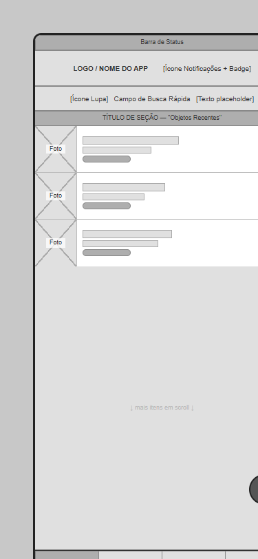

*Figura W1 — Wireframe da Home: divisão de áreas (status bar, header, campo de busca, listagem em scroll, FAB e nav bar).*

## Tela 2 — Buscar Objetos

**Função da tela:** Permitir busca detalhada de objetos com múltiplos filtros para refinar resultados.

**Elementos presentes:**

- Campo de busca no topo (com ícone de lupa)
- Chips de filtro horizontais: Categoria, Local, Data, Status
- Lista vertical de resultados em cards (foto miniatura, título, local, data, badge de status)
- Contador de resultados: "12 objetos encontrados"
- Mensagem de estado vazio: "Nenhum objeto encontrado. Tente outros filtros."

**Próximo passo do usuário:** Aplicar filtros para refinar busca ou clicar em um card para ver os detalhes do objeto.

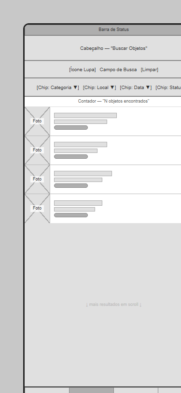

*Figura W2 — Wireframe de Busca: área de campo + chips de filtro + contador + lista de resultados em scroll.*

## Tela 3 — Detalhes do Objeto

**Função da tela:** Exibir informações completas de um objeto específico e oferecer ação de solicitação de retirada.

**Elementos presentes:**

- Foto do objeto em destaque (carrossel se houver múltiplas fotos)
- Título do objeto (ex.: "Carregador USB-C Branco")
- Badge de status (ex.: "Encontrado")
- Informações: categoria, local encontrado, data, hora, observações
- Seção "Onde retirar" com localização
- Botão principal: "Solicitar Retirada" (visível apenas se status for "Encontrado")
- Botão "Voltar" no header

**Próximo passo do usuário:** Tocar em "Solicitar Retirada" para iniciar o processo de recuperação, ou voltar à busca.

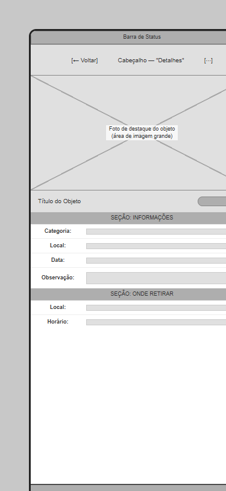

*Figura W3 — Wireframe de Detalhes: imagem de destaque, seções de informações, seção de retirada e botão fixo na base.*

## Tela 4 — Cadastrar Objeto Perdido

**Função da tela:** Formulário para o aluno registrar um objeto que perdeu no campus.

**Elementos presentes:**

- Título: "Cadastrar Objeto Perdido"
- Campos do formulário:
  - Nome do objeto (texto livre, obrigatório)
  - Categoria (dropdown: Eletrônicos, Documentos, Roupas, Acessórios, Outros)
  - Descrição (textarea, opcional)
  - Local onde perdeu (dropdown com locais do campus)
  - Data aproximada (date picker)
  - Foto (upload opcional)
- Indicador de campos obrigatórios (*)
- Botão "Enviar Cadastro" (primário)
- Botão "Cancelar" (secundário)

**Próximo passo do usuário:** Preencher os campos e enviar, recebendo tela de confirmação.

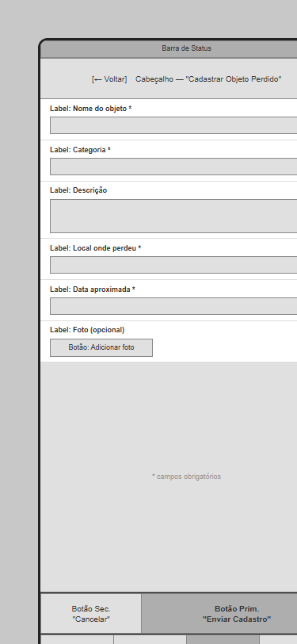

*Figura W4 — Wireframe de Cadastro: campos de formulário (texto, dropdown, textarea, date picker, upload) e barra de ações.*

## Tela 5 — Painel do Funcionário

**Função da tela:** Visão geral administrativa com métricas, solicitações pendentes e ações rápidas de gerenciamento.

**Elementos presentes:**

- Header com nome do funcionário e ícone de notificações
- Cards de métricas: "Solicitações pendentes (5)", "Objetos cadastrados (23)", "Casos encerrados este mês (18)"
- Lista de solicitações recentes com botões "Validar" e "Rejeitar"
- Botão de ação: "Cadastrar Objeto Encontrado"
- Navegação por tabs ou menu: Objetos, Solicitações, Histórico, Perfil

**Próximo passo do usuário:** Validar uma solicitação pendente, cadastrar novo objeto encontrado, ou consultar histórico de casos.

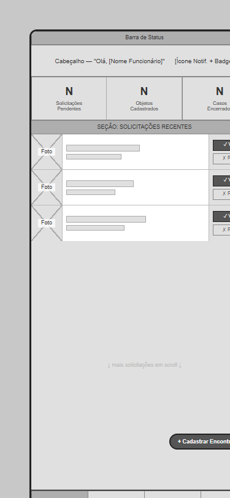

*Figura W5 — Wireframe do Painel Admin: cards de métricas, lista de solicitações com ações validar/rejeitar, FAB e nav bar administrativa.*

---

# 8. Protótipo de Alta Fidelidade

O protótipo de alta fidelidade foi desenvolvido no Figma com visual limpo, moderno e acessível, aplicando os conceitos de IHC estudados em aula: affordances, heurísticas de Nielsen, acessibilidade para PCD e design centrado no usuário.

---

## 8.1 Paleta de Cores

## Cores favoritas das personas

| Persona | Cor 1 | Cor 2 | Cor 3 |
|---|---|---|---|
| Ana Silva | Azul | Roxo | Branco |
| Carlos Mendes | Verde | Cinza | Azul |
| Beatriz Oliveira | Azul | Amarelo | Preto |

## Paleta escolhida

| Cor | Código HEX | Nome informal | Uso na interface |
|---|---|---|---|
| Primária | #1E3A5F | Azul Naval | Botões principais, header, links, elementos de ação |
| Secundária | #2E7D8C | Teal Médio | Ícones de apoio, bordas de destaque, chips ativos |
| Accent | #4A90D9 | Azul Claro | Ícones de navegação ativos, badges informativos |
| Fundo | #F5F7FA | Cinza Névoa | Background geral das telas |
| Superfície | #FFFFFF | Branco | Cards, modais, formulários |
| Texto principal | #1E293B | Azul-Carvão | Títulos, corpo de texto, labels |
| Texto secundário | #637389 | Slate Médio (AA) | Informações auxiliares, placeholders, captions |
| Alerta/erro | #B91C1C | Vermelho Escuro | Mensagens de erro, status "Perdido", validações |
| Aviso | #B45309 | Âmbar Escuro | Status "Em análise", alertas de atenção |
| Sucesso/confirmação | #15803D | Verde Escuro | Status "Finalizado", confirmações, feedback positivo |
| Info | #1D4ED8 | Azul Profundo | Status "Aguardando retirada", notificações informativas |

**Lógica cromática usada:**  
Esquema análogo azul — o trio primária (#1E3A5F), accent (#4A90D9) e secundária (#2E7D8C) ocupa um mesmo arco do círculo cromático (azul naval → azul claro → azul-esverdeado), garantindo coesão visual natural. As cores de status são versões dessaturadas e escurecidas das convenções semáforo (vermelho/âmbar/verde), evitando vibrância excessiva e mantendo legibilidade.

**Ferramenta utilizada:**  
Coolors (coolors.co) para exploração de harmonias e geração da paleta; WebAIM Contrast Checker para validação de contraste conforme WCAG AA.

**Justificativa das escolhas:**  
A paleta foi definida para transmitir seriedade institucional, clareza visual e acessibilidade no contexto universitário. O azul naval (#1E3A5F) remete a ambientes acadêmicos e comunica confiança; o teal médio (#2E7D8C) complementa o azul com equilíbrio, sem competir visualmente com os elementos principais; o fundo cinza-névoa (#F5F7FA) suaviza a leitura em comparação ao branco puro, reduzindo fadiga visual em sessões longas. As cores de status utilizam versões escuras e pouco saturadas das convenções de alerta, aviso e sucesso, garantindo contraste adequado sobre fundos claros e evitando excesso visual. A persona Beatriz (PCD auditiva) se beneficia do alto contraste azul-carvão sobre cinza-névoa (ratio > 12:1) e da redundância de status por cor + ícone + texto.

**Visualização da paleta:**

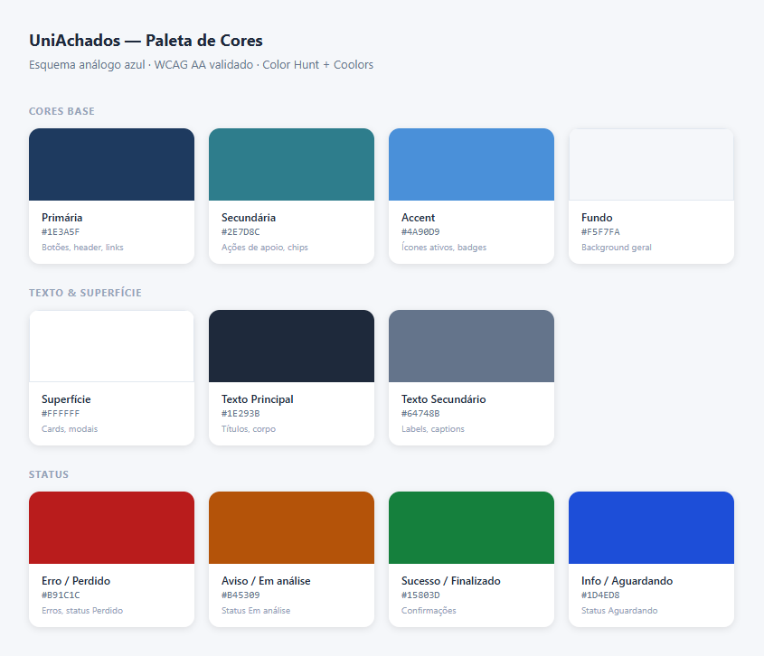
*Figura 1 — Paleta completa do UniAchados: cores base (análogo azul), texto/superfície e cores de status. Gerada com Coolors e validada via WebAIM Contrast Checker (WCAG AA).*

---

## 8.2 Tipografia e Ícones / Affordances

## Tipografia

**Fonte principal:** Inter (Google Fonts)  
**Fonte secundária:** Não utilizada — Inter atende todos os usos com variação de peso (Regular 400, Medium 500, SemiBold 600, Bold 700).  
**Justificativa:** Inter foi projetada especificamente para interfaces digitais, com excelente legibilidade em telas e em tamanhos reduzidos (mobile). É neutra, profissional e gratuita. Sua ampla família de pesos permite criar hierarquia visual sem necessidade de fonte adicional.

**Visualização da hierarquia tipográfica:**

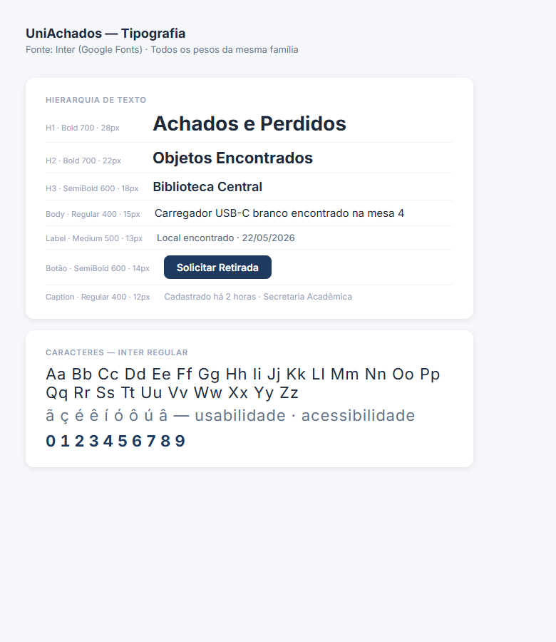
*Figura 2 — Hierarquia tipográfica completa: H1 (Bold 700, 28px) até Caption (Regular 400, 12px), com amostra dos caracteres especiais do português e botão de exemplo na cor primária.*

## Ícones

**Biblioteca de ícones utilizada:** Material Icons (Google) — estilo Outlined  
**Justificativa:** Material Icons é uma biblioteca amplamente reconhecida, com ícones universais e intuitivos. O estilo Outlined oferece leveza visual compatível com a proposta de interface limpa. São gratuitos, disponíveis no Figma e compatíveis com o estilo da fonte Inter.

**Visualização dos ícones e badges de status:**

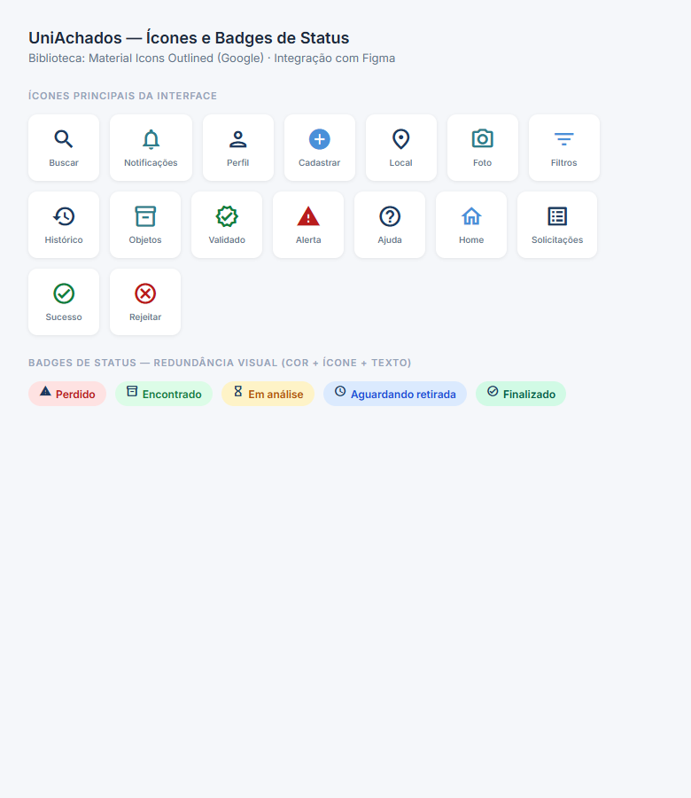
*Figura 3 — Ícones principais do sistema (Material Icons Outlined) e badges de status com redundância visual: cor de fundo + ícone + texto, garantindo acessibilidade para PCD auditiva (sem dependência de som).*

## Affordances usadas

| Tela | Tipo de affordance | Onde aparece | Função | Como ajuda o usuário |
|---|---|---|---|---|
| Home | Affordance de padrão | Cards de objetos com sombra e bordas arredondadas | Indicar que os cards são clicáveis | O usuário reconhece pelo padrão visual (elevação + cursor) que pode interagir |
| Buscar | Affordance metafórica | Ícone de lupa no campo de busca | Comunicar função de pesquisa | A metáfora da lupa é universalmente associada à busca |
| Detalhes | Affordance explícita | Botão "Solicitar Retirada" com texto claro | Indicar ação disponível sem ambiguidade | O texto do botão descreve exatamente o que acontecerá ao clicar |
| Cadastro | Affordance física | Botão primário azul com elevação e tamanho maior | Comunicar que é o elemento de ação principal | Cor, tamanho e sombra comunicam importância e interatividade |
| Painel admin | Affordance negativa | Botão "Enviar" cinza (desabilitado) quando formulário incompleto | Indicar que a ação não está disponível ainda | A cor e ausência de sombra comunicam inatividade |

---

## 8.3 Aplicação das Heurísticas de Nielsen

| Heurística | Tela(s) onde aparece | Como foi aplicada | Impacto positivo na experiência do usuário |
|---|---|---|---|
| 1. Visibilidade do estado do sistema | Minhas Solicitações, Detalhes do Objeto, Cadastro | Badges de status coloridos (Perdido, Encontrado, Em análise, Aguardando retirada, Finalizado) sempre visíveis; barra de progresso durante upload de fotos; tela de confirmação após ações | O usuário sabe a todo momento em que etapa está seu objeto ou solicitação, reduzindo ansiedade e incerteza |
| 2. Consistência e padrões | Todas as telas | Mesma tipografia, espaçamento, estilo de botões e posição da navegação em todas as telas; cores de status idênticas em qualquer contexto; ícones da mesma biblioteca | O usuário aprende a interface uma vez e aplica o conhecimento em todas as telas, reduzindo curva de aprendizado |
| 3. Prevenção de erros | Cadastro de Objeto, Solicitar Retirada, Painel Admin | Campos com validação em tempo real; botão "Enviar" desabilitado até formulário completo; dropdown para categorias e locais (evita digitação incorreta); modal de confirmação antes de encerrar caso | Erros são evitados antes de acontecerem, eliminando frustração e retrabalho |
| 4. Reconhecimento em vez de memorização | Buscar Objetos, Home, Filtros | Filtros sempre visíveis na tela (não escondidos em menu); cards com foto + título + local (informações visuais); ícones reconhecíveis na navegação; histórico de buscas recentes | O usuário não precisa memorizar informações ou caminhos — tudo está visível e acessível por reconhecimento visual |

**Prints com marcações:** *Inserir imagens das telas com anotações indicando onde cada heurística se manifesta.*

---

## 8.4 Telas Finais

## Tela Final 1 — Tela de Boas-vindas

**Objetivo principal:** Apresentar o sistema ao usuário e direcionar para login ou cadastro.  
**Explicação:** Tela inicial com identidade visual do UniAchados, breve descrição do propósito ("Encontre seus objetos perdidos no campus") e dois botões: "Entrar" e "Criar conta". Design limpo e centrado com ilustração ou ícone representativo.  

| Vista Mobile | Vista Web |
|:---:|:---:|
| 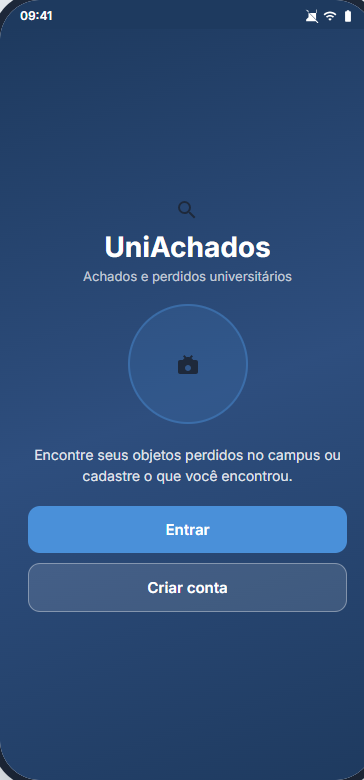 | 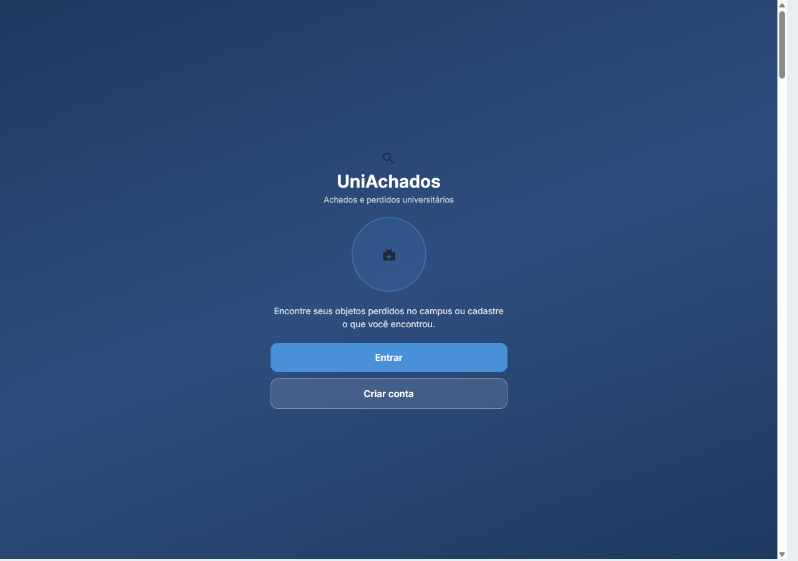 |

*Figura 4 — Tela de boas-vindas: mobile (shell de celular) e web (tela cheia).*

## Tela Final 2 — Home do Aluno

**Objetivo principal:** Oferecer visão geral e acesso rápido às funcionalidades principais.  
**Explicação:** Tela pós-login com busca rápida no topo, seção de objetos recentes em cards horizontais, botão flutuante para cadastrar objeto e barra de navegação inferior. É o hub central de onde o aluno acessa tudo.  

| Vista Mobile | Vista Web |
|:---:|:---:|
| 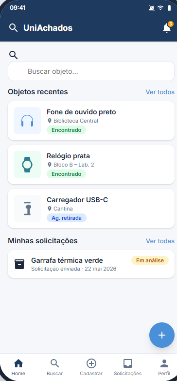 |  |

*Figura 5 — Home do Aluno com objetos recentes e navegação adaptada para cada contexto.*

## Tela Final 3 — Buscar Objetos

**Objetivo principal:** Permitir busca e filtragem de objetos cadastrados no sistema.  
**Explicação:** Campo de busca no topo com chips de filtro abaixo (Categoria, Local, Data, Status). Resultados exibidos em lista de cards verticais com miniatura, título, local e badge de status. Contador de resultados visível.  

| Vista Mobile | Vista Web |
|:---:|:---:|
| 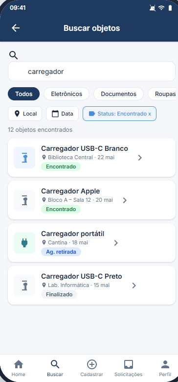 |  |

*Figura 6 — Busca com chips de filtro e lista de resultados.*

## Tela Final 4 — Resultado da Busca (com filtros ativos)

**Objetivo principal:** Exibir resultados filtrados de forma clara e navegável.  
**Explicação:** Tela com filtros ativos destacados como chips azuis (com "X" para remover), lista de cards resultantes e mensagem de vazio quando não há resultados. Permite refinamento contínuo.  

| Vista Mobile | Vista Web |
|:---:|:---:|
| 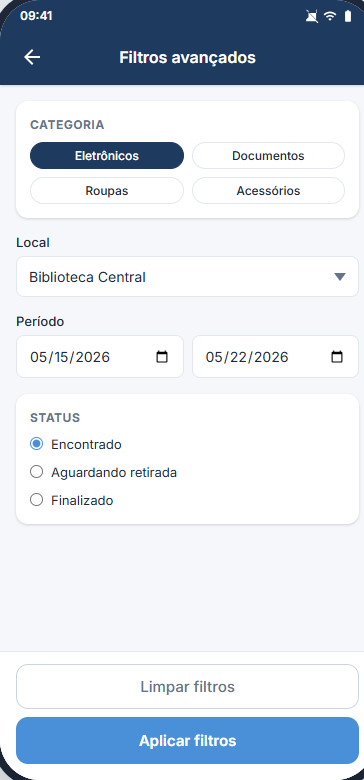 | 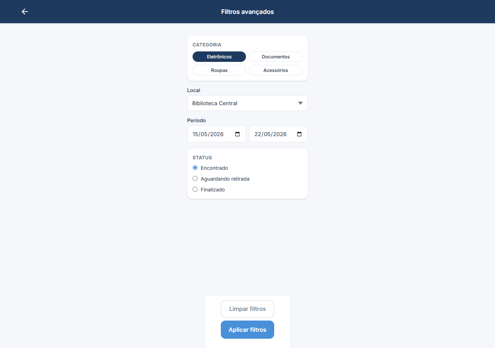 |

*Figura 7 — Filtros avançados com seções por categoria, local e período.*

## Tela Final 5 — Filtros Avançados

**Objetivo principal:** Oferecer opções detalhadas de filtragem em tela dedicada (modal ou fullscreen).  
**Explicação:** Tela/modal com seções: Categoria (checkboxes), Local (dropdown ou lista), Período (date range), Status (radio buttons). Botões "Aplicar filtros" e "Limpar tudo" na base.  

| Vista Mobile | Vista Web |
|:---:|:---:|
|  |  |

*Figura 8 — Painel de filtros avançados com checkboxes, dropdown e range de datas.*

## Tela Final 6 — Detalhes do Objeto

**Objetivo principal:** Exibir todas as informações de um objeto e permitir ação de solicitação.  
**Explicação:** Foto grande no topo (carrossel), abaixo: título, badge de status, descrição, categoria, local, data/hora, observações. Botão principal "Solicitar Retirada" fixo na base. Informações organizadas em seções claras.  

| Vista Mobile | Vista Web |
|:---:|:---:|
| 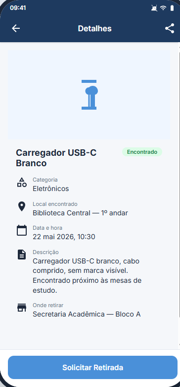 | 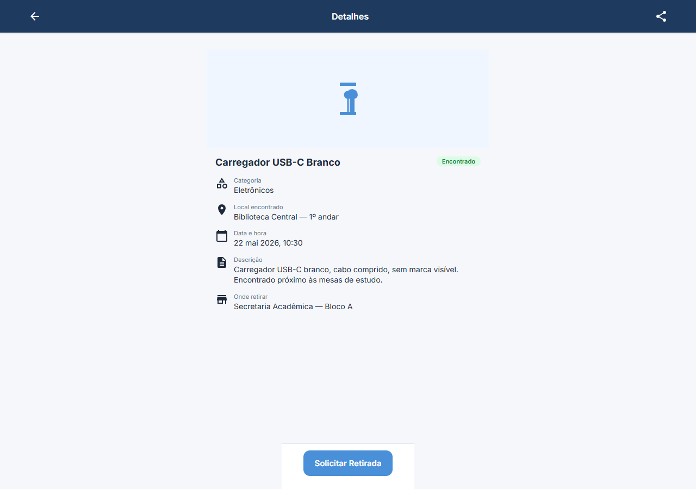 |

*Figura 9 — Tela de detalhes: foto, informações completas e botão de solicitação.*

## Tela Final 7 — Solicitar Retirada

**Objetivo principal:** Coletar informações do solicitante para validação de identidade.  
**Explicação:** Formulário curto: campo "Descreva características do objeto" (para provar que é o dono), documento de identificação (upload ou número), observações opcionais. Instrução clara no topo sobre o processo.  

| Vista Mobile | Vista Web |
|:---:|:---:|
| 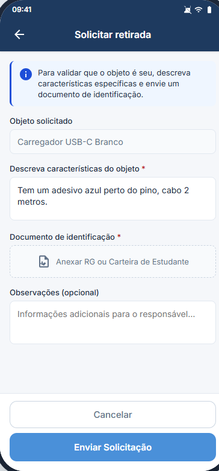 | 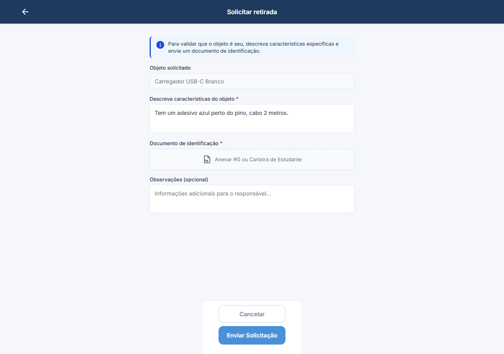 |

*Figura 10 — Formulário de solicitação de retirada com campos de identificação.*

## Tela Final 8 — Confirmação da Solicitação

**Objetivo principal:** Informar que a solicitação foi registrada e indicar próximos passos.  
**Explicação:** Tela com ícone de sucesso (check verde), mensagem "Solicitação enviada com sucesso!", resumo do pedido, próximos passos ("Aguarde validação do responsável"), e botão "Ver minhas solicitações".  

| Vista Mobile | Vista Web |
|:---:|:---:|
| 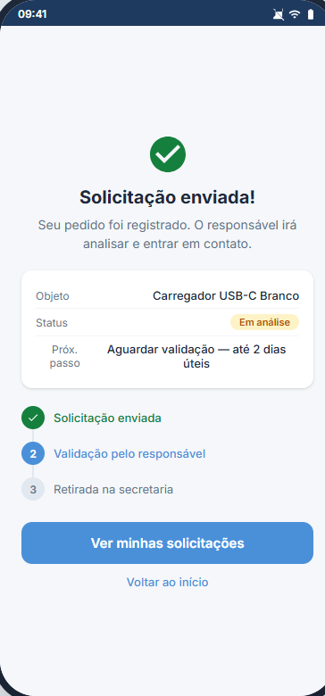 | 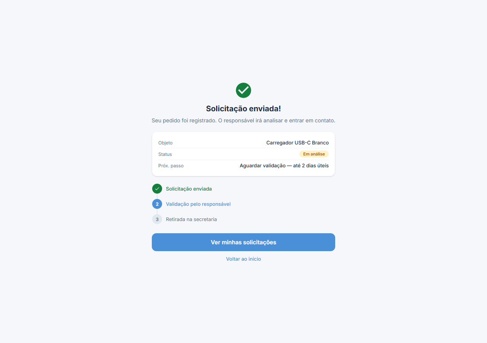 |

*Figura 11 — Confirmação de solicitação com resumo e indicador de próximos passos.*

## Tela Final 9 — Cadastrar Objeto Perdido

**Objetivo principal:** Permitir que o aluno registre um item que perdeu no campus.  
**Explicação:** Formulário com campos: nome do objeto, categoria (dropdown), descrição, local onde perdeu (dropdown com locais do campus), data aproximada, foto opcional. Indicador de obrigatórios (*). Botões "Enviar" e "Cancelar".  

| Vista Mobile | Vista Web |
|:---:|:---:|
| 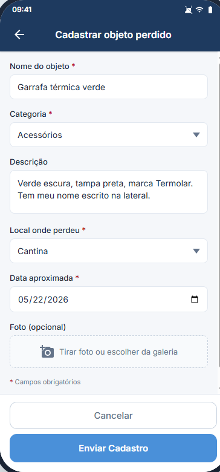 | 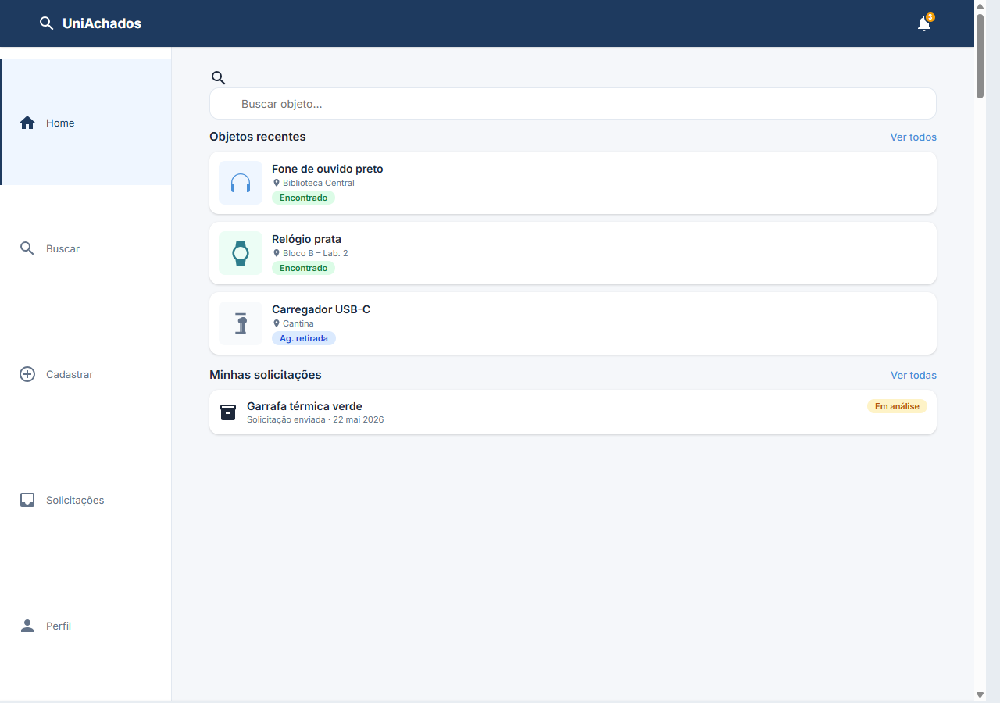 |

*Figura 12 — Cadastro de objeto perdido com campos obrigatórios sinalizados.*

## Tela Final 10 — Cadastrar Objeto Encontrado (Funcionário)

**Objetivo principal:** Permitir que o funcionário registre um item recebido/encontrado.  
**Explicação:** Similar ao cadastro de perdido, mas com campos adicionais: "Entregue por" (opcional), local de armazenamento, e status inicial "Encontrado". Foto obrigatória para facilitar identificação.  

| Vista Mobile | Vista Web |
|:---:|:---:|
| 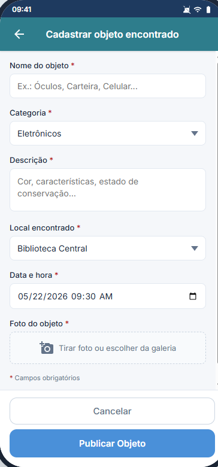 | 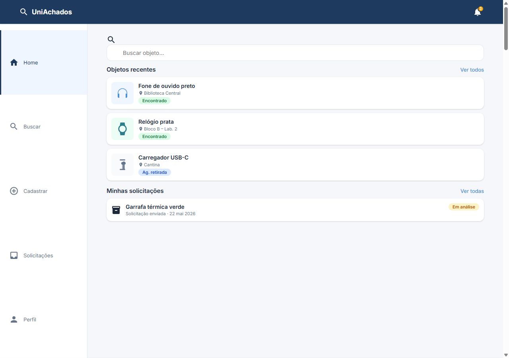 |

*Figura 13 — Cadastro de objeto encontrado (fluxo do funcionário) com campo de localização de guarda.*

## Tela Final 11 — Minhas Solicitações

**Objetivo principal:** Permitir ao aluno acompanhar o status de todas as suas solicitações.  
**Explicação:** Lista de cards com: nome do objeto, data da solicitação, badge de status atualizado. Cada card é clicável para ver detalhes. Tabs para filtrar: "Em andamento" e "Finalizadas".  

| Vista Mobile | Vista Web |
|:---:|:---:|
| 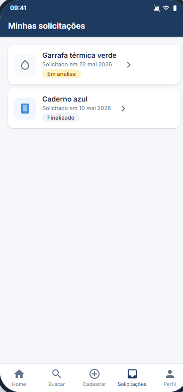 |  |

*Figura 14 — Lista de solicitações do aluno com status atualizados em tempo real.*

## Tela Final 12 — Notificações

**Objetivo principal:** Centralizar alertas e atualizações importantes para o usuário.  
**Explicação:** Lista cronológica de notificações com ícone, título, descrição curta e timestamp. Itens não lidos com destaque visual (fundo levemente colorido). Exemplos: "Sua solicitação foi aprovada", "Novo objeto encontrado na Biblioteca".  

| Vista Mobile | Vista Web |
|:---:|:---:|
| 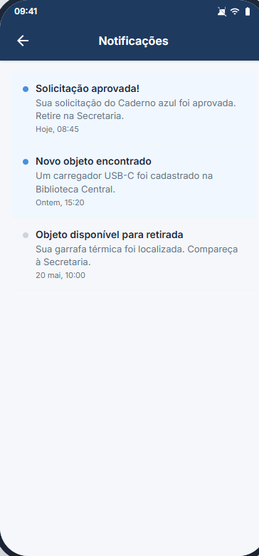 |  |

*Figura 15 — Central de notificações com destaque visual para itens não lidos.*

## Tela Final 13 — Perfil do Usuário

**Objetivo principal:** Exibir e permitir edição de dados pessoais e configurações.  
**Explicação:** Foto/avatar, nome, e-mail institucional, curso/setor. Opções: editar perfil, configurações de notificação, alterar senha, sair. Design simples com lista de opções.  

| Vista Mobile | Vista Web |
|:---:|:---:|
| 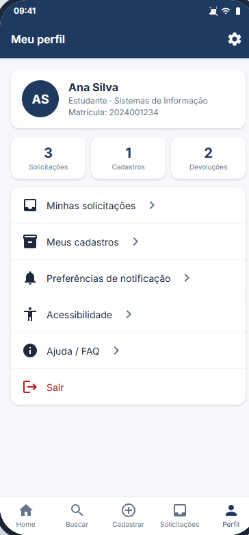 |  |

*Figura 16 — Perfil do usuário com estatísticas e opções de configuração.*

## Tela Final 14 — Ajuda / FAQ

**Objetivo principal:** Esclarecer dúvidas frequentes e orientar o uso do sistema.  
**Explicação:** Lista de perguntas frequentes em formato accordion (clica para expandir resposta). Perguntas como: "Como solicitar retirada?", "Quanto tempo o objeto fica guardado?", "Como cadastrar um objeto encontrado?". Campo de busca no topo.  

| Vista Mobile | Vista Web |
|:---:|:---:|
| 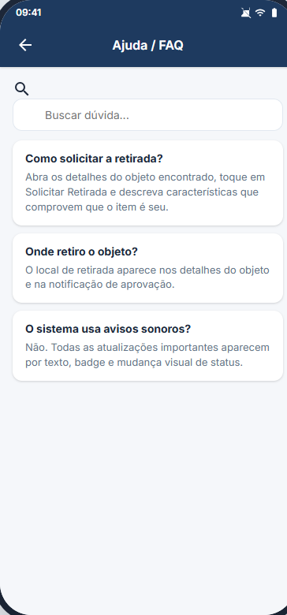 |  |

*Figura 17 — FAQ com busca e lista de perguntas frequentes.*

## Tela Final 15 — Painel do Funcionário (Dashboard)

**Objetivo principal:** Oferecer visão gerencial e acesso rápido a ações administrativas.  
**Explicação:** Cards de métricas (solicitações pendentes, objetos cadastrados, casos encerrados no mês). Lista de solicitações recentes com ações rápidas (Validar/Rejeitar). Botão de cadastro de objeto encontrado. Navegação por tabs.  

| Vista Mobile | Vista Web |
|:---:|:---:|
| 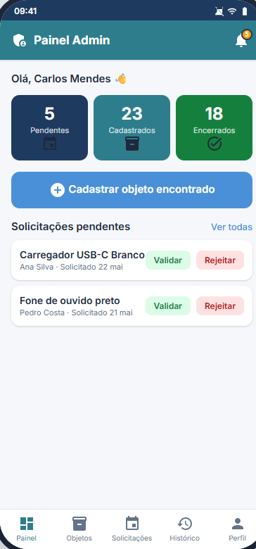 |  |

*Figura 18 — Painel do funcionário com métricas, solicitações pendentes e navegação administrativa.*

## Tela Final 16 — Lista de Objetos Cadastrados (Admin)

**Objetivo principal:** Permitir ao funcionário visualizar e gerenciar todos os objetos do sistema.  
**Explicação:** Tabela/lista com: foto miniatura, nome, categoria, data de cadastro, status. Filtros no topo. Ações em cada item: editar, alterar status, excluir. Paginação ou scroll infinito.  

| Vista Mobile | Vista Web |
|:---:|:---:|
| 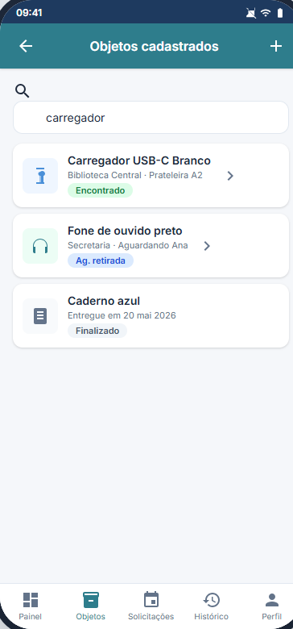 | 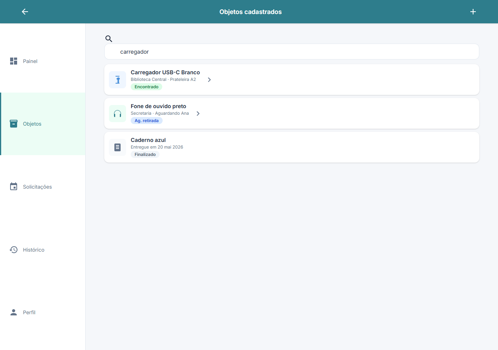 |

*Figura 19 — Lista administrativa de objetos com filtros, status e ações por item.*

## Tela Final 17 — Validação de Solicitação (Admin)

**Objetivo principal:** Permitir ao funcionário avaliar e decidir sobre uma solicitação de retirada.  
**Explicação:** Tela com dados do objeto (foto, descrição), dados do solicitante (nome, justificativa, documento), e dois botões de ação: "Aprovar Retirada" (verde) e "Rejeitar" (vermelho). Campo opcional para observações.  

| Vista Mobile | Vista Web |
|:---:|:---:|
| 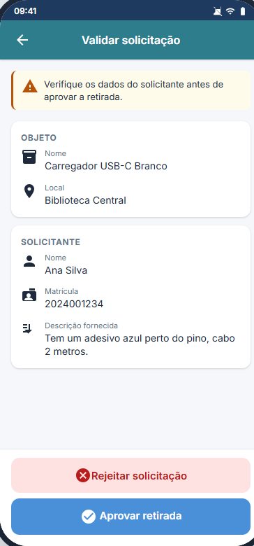 |  |

*Figura 20 — Tela de validação com dados do solicitante e botões de aprovar/rejeitar.*

## Tela Final 18 — Encerramento do Caso

**Objetivo principal:** Confirmar a finalização de um caso após retirada realizada.  
**Explicação:** Resumo do caso (objeto, solicitante, datas), campo para observações finais, checkbox "Confirmo que o objeto foi entregue ao solicitante", botão "Encerrar Caso". Após encerramento, status muda para "Finalizado".  

| Vista Mobile | Vista Web |
|:---:|:---:|
| 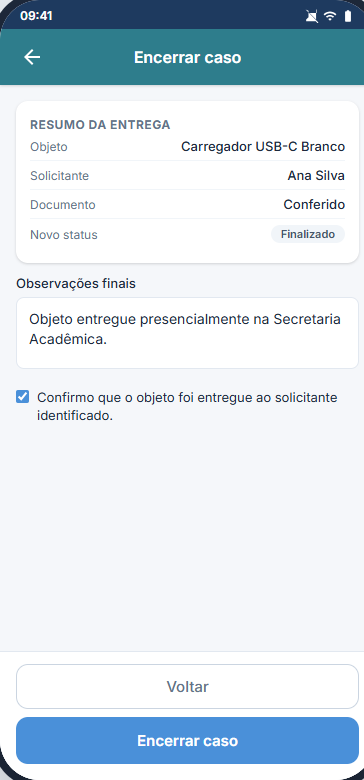 |  |

*Figura 21 — Tela de encerramento do caso com confirmação de entrega.*

---

# 9. Considerações Finais

## O que vocês aprenderam

O desenvolvimento deste projeto proporcionou aprendizados significativos sobre o processo de design centrado no usuário. Compreendemos na prática que projetar interfaces vai muito além da estética: envolve entender profundamente quem são os usuários, seus contextos, limitações e necessidades. A construção de personas e jornadas de uso nos forçou a pensar em cenários reais e a fundamentar cada decisão de design em evidências e princípios de IHC. Também aprendemos a importância da acessibilidade como requisito inegociável, não como funcionalidade adicional.

## Quais foram os maiores desafios

Os maiores desafios foram: (1) equilibrar simplicidade com completude — manter a interface limpa sem omitir funcionalidades essenciais; (2) projetar para perfis de uso muito diferentes (aluno jovem nativo digital vs. funcionário com menor familiaridade tecnológica); (3) garantir acessibilidade para PCD auditiva sem comprometer a experiência dos demais usuários; e (4) manter consistência visual e funcional ao longo de mais de 15 telas distintas.

## O que vocês fariam diferente

Com mais tempo e domínio técnico, realizaríamos testes de usabilidade com usuários reais (alunos e funcionários da universidade) para validar as decisões de design antes da versão final. Também gostaríamos de explorar funcionalidades adicionais como notificações push, integração com o sistema acadêmico institucional e geolocalização para indicar pontos de coleta no mapa do campus.

## Como essa experiência contribui para sua formação profissional

Esta experiência demonstrou que o desenvolvimento de software não se limita à programação: a qualidade da interface determina se o sistema será efetivamente utilizado ou abandonado. Entender o usuário, aplicar heurísticas de usabilidade e projetar com acessibilidade são competências essenciais para qualquer profissional de Sistemas de Informação. O processo de documentação acadêmica também reforçou a importância de justificar decisões técnicas com fundamentação teórica, habilidade valorizada no mercado de trabalho.

---

# 10. Referências

## Fontes teóricas

- NIELSEN, J. **10 Usability Heuristics for User Interface Design**. Nielsen Norman Group, 1994. Disponível em: https://www.nngroup.com/articles/ten-usability-heuristics/
- NORMAN, D. **The Design of Everyday Things**. Revised and expanded edition. Basic Books, 2013.
- BARBOSA, S. D. J.; SILVA, B. S. **Interação Humano-Computador**. Elsevier, 2010.
- W3C. **Web Content Accessibility Guidelines (WCAG) 2.1**. 2018. Disponível em: https://www.w3.org/TR/WCAG21/
- BRASIL. Departamento de Governo Eletrônico. **eMAG — Modelo de Acessibilidade em Governo Eletrônico**, v. 3.1. Brasília: SLTI/MP, 2014. Disponível em: https://emag.governoeletronico.gov.br/
- PREECE, J.; ROGERS, Y.; SHARP, H. **Design de Interação: Além da Interação Humano-Computador**. 3ª ed. Bookman, 2013.

## Fontes práticas

- CCSL/IME-USP. **Achusp — Site de achados e perdidos para a Universidade de São Paulo**. Disponível em: https://ccsl.ime.usp.br/pt-br/projeto/achusp/
- Bibliotecas EEL/USP. **Achados & Perdidos**. Disponível em: https://www.bibliotecas.eel.usp.br/servicos/achados-perdidos
- IFSP São João da Boa Vista. **Manual de Serviços Digitais — Como acompanhar e atualizar um chamado (GLPI)**. Disponível em: https://docs-cti.sbv.ifsp.edu.br/books/manual-de-servi%C3%A7os-digitais/page/%F0%9F%94%84-como-acompanhar-e-atualizar-um-chamado
- FoundIt. **FoundIt (Lost and Found)**. Google Play. Disponível em: https://play.google.com/store/apps/details?id=za.co.founditapp&hl=en-US
- FoundIt Project. **Lost & Found for Students — University of Maryland beta**. Disponível em: https://founditproject.com/
- MissingX. **Lost and Found Solution**. Disponível em: https://www.missingx.com/
- Pixit. **Lost and Found Management Made Simple**. Disponível em: https://pixithq.com/

## Ferramentas utilizadas

- Figma — Prototipação de baixa e alta fidelidade, design de interface e criação de componentes reutilizáveis.
- Coolors (coolors.co) — Geração e validação da paleta de cores.
- WebAIM Contrast Checker — Verificação de contraste para acessibilidade WCAG AA.
- Material Icons (Google) — Biblioteca de ícones utilizada no protótipo.
- Mermaid — Criação do diagrama de fluxo de navegação (mapa do site).

## Tutoriais e vídeos

- Google. **Material Design Guidelines**. Disponível em: https://m3.material.io/
- Figma. **Figma for Beginners**. Disponível em: https://www.youtube.com/playlist?list=PLXDU_eVOJTx7QHLShNqIXL1Cgbxj7HlN4
- Nielsen Norman Group. **UX Research Methods**. Disponível em: https://www.nngroup.com/articles/which-ux-research-methods/
